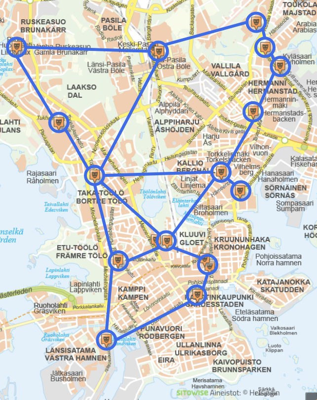
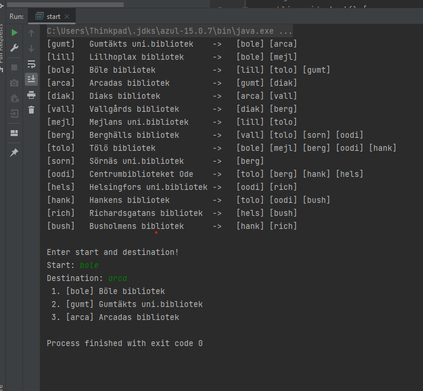

# Java Route Search

## Description of java navigation system:
- It is a navigation system that can most efficiently always find the shortest route between the start  
 point startNode and the destination endNode, and you should use the A * algorithm to solve this.

- The program should work so that you get a list of all libraries and then you can enter a starting point and a destination. The program then calculates the shortest route (see example driving at the bottom).

## Here is map of the navigation system:

## And here is program run test: 

### PART 1 - Class Node.
The first part was that I follow the structure in the task description of part 1 so implement it in the Node Class.
### PART 2 - Print out the names of all the libraries and list the neighbors.

- I started by creating a new class called class Route and into the Route class there is "listNodesAndLinks ()" which loops through all nodes values ​​and retrieves node key and node name then for each line of nodes key and name printer all node neighbor.
- "getNode (String key)" method that returns the node key when you insert it into a string.
- "getRoute (Node startNode, Node endNode)".

### PART 3 - Calculate estimated cost H (distance) from a node to a given destination.
- Here I created a "calculateH (Node endNode)" method in the class Node that calculates and returns the H-value that calculates distance from the current node (this) to the destination (endNode).

### PART 4 ​​- Calculate total cost G from a given starting point to the current node.

- Here I created a "calculateG (Node startNode)" method in the class Node that calculates and returns the G-value. Then follow the text in the task description.
- "getF (Node startNode, Node endNode)" which pluses G and H methods together and returns the F-value.

### PART 5 - Implement the A * algorithm to calculate the shortest route between a given starting point and destination.
- Here I created a "getRoute ()" method that takes in a start point (startNode) and a destination (endNode) (both Node objects) as input parameters
- then I created an A * algorithm that calculates and returns a list (eg ArrayList) containing all nodes (libraries) from startpun.kt to destination that you have to pass that corresponds to the shortest route.
- I created a method called "inputTest (String textDefault)" which tests that the text input is a node key by using Route.getNode which tests that the string is in the key list.

 